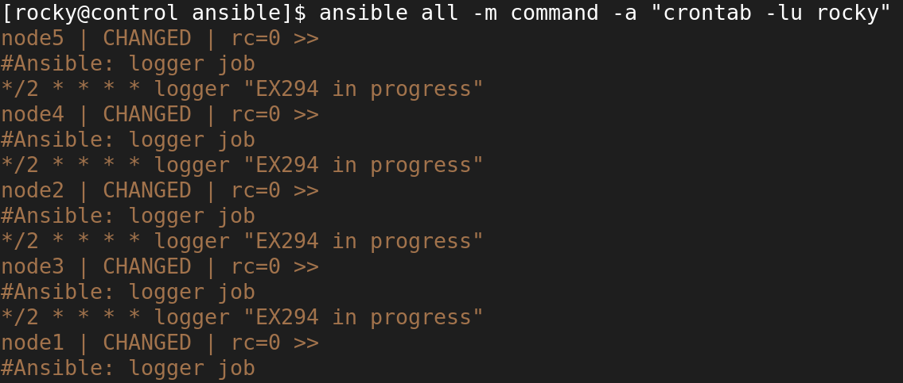

1. create `crontab.yml`
```yaml
- name: use crontab
  hosts: all
  tasks:
     - name: use cron job
       ansible.builtin.cron:
           name: "logger job"
           minute: "*/2"
           user: rhel
           job: logger "EX294 in progress"
           state: present
```
2. run playbook
```shell
$ ansible-playbook crontab.yml
```
3. test
```shell
$ ansible all -m command -a "crontab -lu rocky"
```
success message:
